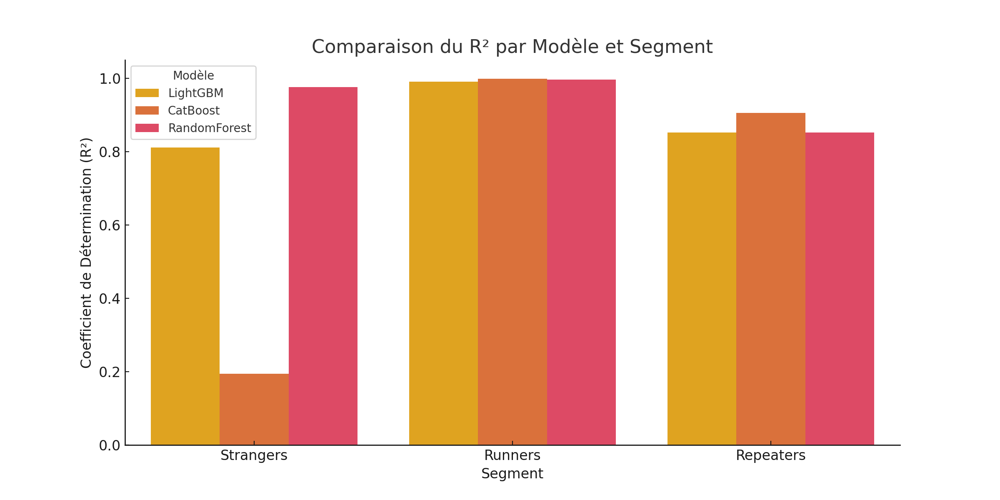

# 📊 Prédiction des Coûts Unitaires par Segmentation Client (Strangers, Runners, Repeaters)

Ce projet s’inscrit dans le cadre d’une étude menée chez **CMR Group Tunis** pour améliorer l’estimation des prix de revient des produits.  
Il cible une approche segmentée par typologie client :

- **Strangers** : nouveaux ou irréguliers
- **Runners** : achats fréquents, produits récurrents
- **Repeaters** : clients fidèles et réguliers

---

## 🎯 Objectif

- Prédire avec précision le **coût unitaire d’un produit (`UnitCostToEuro`)**
- Évaluer plusieurs modèles de régression
- Identifier le **meilleur modèle par segment client**

---

## 🧠 Données utilisées

Les données internes incluent :

- **Product** : identifiant produit
- **QTY** : quantité achetée
- **TotalCostToEuro** : coût total
- **MoisAchat** : mois d’achat
- **RRS_Purchase** : segment client (`Strangers`, `Runners`, `Repeaters`)

---

## 🤖 Modèles testés

- `Random Forest Regressor`
- `LightGBM Regressor`
- `CatBoost Regressor`

Chaque modèle est entraîné séparément pour chaque segment.

---

## 📊 Résultats comparatifs

| Segment     | Modèle         | MAE (€) | RMSE (€) | R²    |
|-------------|----------------|---------|----------|-------|
| **Strangers** | LightGBM       | 7.90    | 242.72   | 0.811 |
| **Strangers** | CatBoost       | 11.17   | 501.09   | 0.195 |
| **Strangers** | Random Forest  | 1.38    | 86.14    | 0.976 |
| **Runners**   | LightGBM       | 1.06    | 8.07     | 0.991 |
| **Runners**   | CatBoost       | 0.65    | 1.99     | 0.999 |
| **Runners**   | Random Forest  | 0.22    | 5.03     | 0.996 |
| **Repeaters** | LightGBM       | 1.54    | 7.19     | 0.853 |
| **Repeaters** | CatBoost       | 0.93    | 5.75     | 0.906 |
| **Repeaters** | Random Forest  | 1.50    | 7.20     | 0.852 |

---

## 📈 Visualisation des Performances

### Comparaison du R² par modèle et segment

> *Graphique comparatif du coefficient de détermination (R²) pour chaque segment et chaque modèle testé.*

---

## 🏆 Classement Automatique des Meilleurs Modèles

| Segment     | Meilleur Modèle | MAE (€) | RMSE (€) | R²    |
|-------------|-----------------|---------|----------|-------|
| **Strangers** | Random Forest   | 1.38    | 86.14    | 0.976 |
| **Runners**   | CatBoost         | 0.65    | 1.99     | 0.999 |
| **Repeaters** | CatBoost         | 0.93    | 5.75     | 0.906 |

---

## ✅ Conclusion

- Le modèle **Random Forest** est le plus adapté pour les **Strangers**, avec un excellent compromis entre précision et stabilité.
- **CatBoost** domine sur les **Runners** et **Repeaters** avec une performance remarquable sur les données structurées.
- L’approche par **segmentation comportementale** améliore clairement la qualité prédictive des modèles.

---

---

> Projet développé par Karim B. — Data Science & Business Intelligence, CMR Group.
